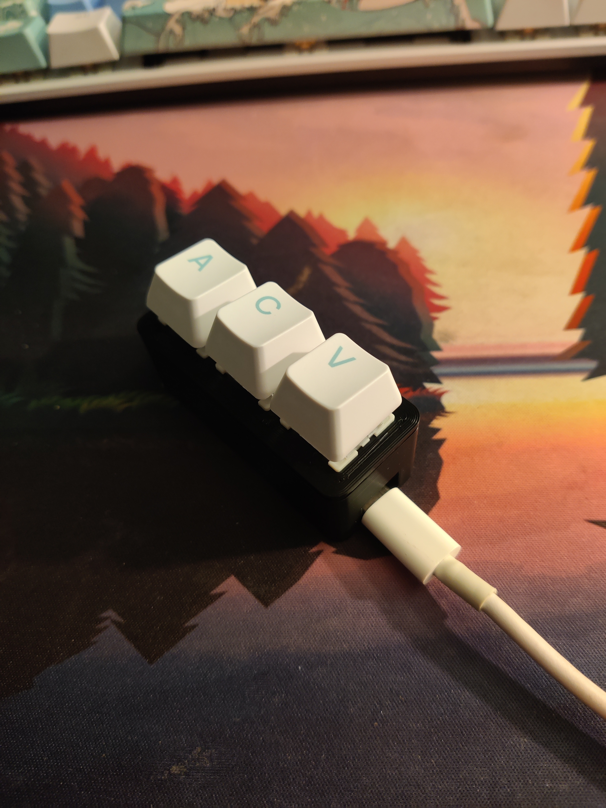
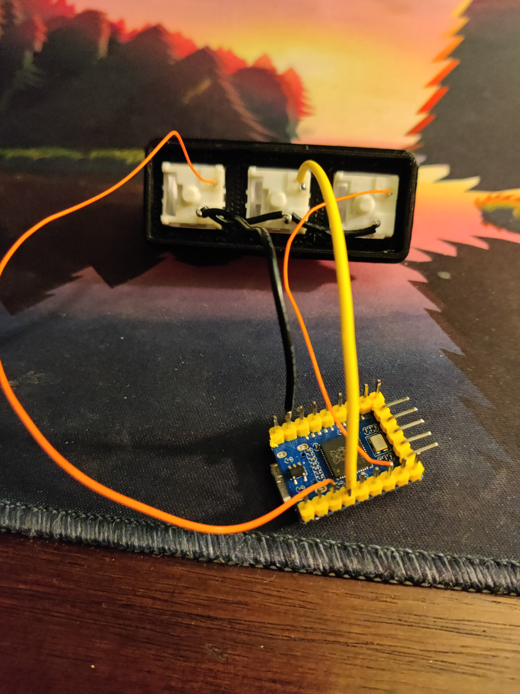

# 3 Key RP2040 Macro Board
#### This is a simple project to make a three key macro pad that has Select-All, copy, and paste.

[RP2040 Info](https://www.waveshare.com/wiki/RP2040-Zero)

### BOM:
  - 1 rp2040-zero
  - 3 Mechanical keyboard switches
  - 3 key caps
  - some wire
  - 3D printed housing

### TOOLS:
  - Solder
  - Soldering iron

### Software needed:
  - [Circuit Python](https://circuitpython.org/board/waveshare_rp2040_zero/   ) ([how to install](https://learn.adafruit.com/getting-started-with-raspberry-pi-pico-circuitpython/circuitpython))
  - Serial terminal for testing ([online version I used](https://www.serialterminal.com/advanced_terminal/src/html/index.html))

### Steps:
- Install circuitpython to the RP2040
- Copy the `adafruit_debouncer.py` & `adafruit_ticks.py` to the root folder. ( I got ticks from [here](https://github.com/adafruit/Adafruit_CircuitPython_Ticks/blob/main/adafruit_ticks.py) and debouncer from [here](https://github.com/adafruit/Adafruit_CircuitPython_Debouncer/blob/main/adafruit_debouncer.py) ) (Did this as I couldnt get the lib for these to work)
- In the adafruit-circuitpython*****.zip [I got from here](https://circuitpython.org/libraries), copy the `lib/adafruit_hid` folder to the rp2040's lib folder.
- Copy the `code.py` [file](https://github.com/GQster/rp240ZeroMacroPad/blob/master/code.py) to the root of the rp2040

**Wire it up:**
- Solder one side of each key to a GND pin (I used pin 2)
- Solder the other pin of each key to a GPIO pin. I used 2, 3, and 6 (avoiding the UART pins). Make sure you update the code with your pins:

`PINS = (
    board.GP2,
    board.GP3,
    board.GP6
)`

To change what the keys do you will want to edit :

    KEYMAP = (
        ("Paste", [MODIFIER, Keycode.V]),
        ("Copy", [MODIFIER, Keycode.C]),
        ("Select all", [MODIFIER, Keycode.A])
    )

[Here is the documentation for the key codes](https://docs.circuitpython.org/projects/hid/en/latest/)

## NOTE:
I was haveing issues importing the libraries correctly and didn't want to spend the time to fix it. So I just coppied the `adafruit_ticks` and `adafruit_debounce` files into the root folder. This work fine, but is messy. 

### References:
I took inspairation (and the stl files) from [this instructable](https://www.instructables.com/Macropad-for-Keyboard-Shortcuts/) but swapped to a RP2040 as it is smaller and I had a few already.
